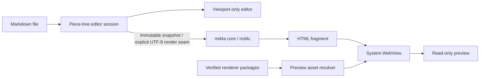

# Architecture

## Goals

- One shared Markdown interpretation on every platform.
- Native document behavior and controls on every platform.
- A small core that can be tested without any GUI SDK.
- Downloadable special-format support without downloadable native executable code.

## Native platform rule

There is no cross-platform application or UI framework. Platforms share no views, view models, navigation, lifecycle, or application-state abstraction. Only the C renderer and data protocols are operating-system-neutral.

## Modules

### Core renderer

The public C interface accepts UTF-8 Markdown and returns a complete UTF-8 HTML fragment plus diagnostics. Its implementation owns md4c configuration, HTML policy, fenced-code annotations, allocation, and errors. Platform code does not call md4c directly.

The interface is intentionally small:

```c
md4a_result md4a_render(const char *markdown, size_t size,
                        const md4a_render_options *options);
void md4a_result_free(md4a_result *result);
```

A caller receives owned HTML and an optional error. This is the main cross-platform seam.

### Native document shells

Each shell owns platform concerns:

| Platform | UI | Editor | Preview |
| --- | --- | --- | --- |
| macOS | SwiftUI + AppKit | MIT Piece Tree + viewport-only AppKit view | `WKWebView` |
| iOS | SwiftUI + UIKit | MIT Piece Tree + viewport-only UIKit view | `WKWebView` |
| Android | Jetpack Compose | md4a Piece Tree + virtualized `LargeDocumentView` | Android `WebView` |
| Windows | WinUI 3, C++ | native text editor control | WebView2 |
| Linux | GTK 4 | `GtkTextView` | WebKitGTK |

A shell loads and saves UTF-8 Documents, debounces edits, invokes the Core renderer off the UI thread, and replaces Preview content on the UI thread. It retains the last successful Preview if rendering fails. Android keeps interactive editing out of whole-document Compose state: its Piece Tree structurally shares unchanged text, its custom View lays out only visible lines, and Save streams a snapshot. The decision and performance contract are recorded in [ADR 0001](adr/0001-android-incremental-virtualized-editor.md) and the [benchmark guide](benchmarks.md).

Android's production editor keeps a persistent piece-tree session as its source of truth and asks the custom `LargeDocumentView` to lay out only visible lines. Edits and undo history therefore operate on ranges rather than replacing a whole Compose `String`. Opening constructs the session on an I/O dispatcher, immutable snapshots make save/render capture O(1), save streams a snapshot directly to the SAF output, and only the JNI Preview boundary materializes a complete `String` because that existing API requires one. CRLF is retained as document content rather than normalized.

Apple uses the same performance invariants with an independent Swift implementation: `ApplePieceTreeBuffer` owns the document, the AppKit/UIKit viewport editor draws only visible no-wrap lines, and Preview/`FileWrapper` are the only full-snapshot seams. Preview renders are serialized and revision-coalesced off the MainActor, then loaded into WebKit through a narrowly scoped cache file. Platform input adapters retain native IME, clipboard, selection and accessibility contracts without assigning the whole document to TextKit.

### Renderer packages

The package manager is a separate module with four operations: list installed packages, inspect an archive, install a verified archive atomically, and remove a package. Package resolution creates a deterministic Preview asset set for the renderer. Platform shells never execute installer code from a package. Store-distributed Apple builds omit remote installation and resolve only renderer packages bundled with the reviewed application.

The Preview host finds annotated fenced blocks in core HTML and dispatches them to an installed renderer by language name. A renderer receives plain source text and may replace only its assigned container. Networking, top-level navigation, popups, file access outside the package, and arbitrary native messaging are disabled.

## Data flow



## Repository strategy

md4c is pinned as a Git submodule under `third_party/md4c`. CMake links the `md4a_core` static library to md4c's HTML renderer. Releases record the exact upstream commit. Dependency source is not copied or silently modified.

Platform builds consume the same core:

- Apple: an XCFramework generated from the CMake target and exposed through a module map;
- Android: CMake through the NDK and a small JNI adapter;
- Windows: CMake static library linked by the WinUI application;
- Linux: CMake static library linked by the GTK application.

## Security invariants

1. A downloaded package is inert until all metadata, hashes, compatibility constraints, and its publisher signature verify.
2. Installation is an atomic rename from a private staging directory.
3. Package identifiers and file paths cannot escape the package root.
4. Package code runs only in the Preview web sandbox and receives no general native bridge.
5. Remote network access is denied by default. A future permission system must be explicit and per-package.
6. Markdown raw HTML follows one shared core policy; the MVP default is escaped/disabled for untrusted Documents.

## MVP sequence

1. Build and test the shared renderer.
2. Ship Apple document shells, then Android, Windows, and Linux shells against the same test corpus.
3. Add package verification and local package installation on platforms whose distribution policy permits downloaded renderer code.
4. Bundle the Mermaid package in Apple store builds; publish it through a signed catalog for supported desktop and Android distributions.
5. Add update UX only after install/remove behavior is stable.
